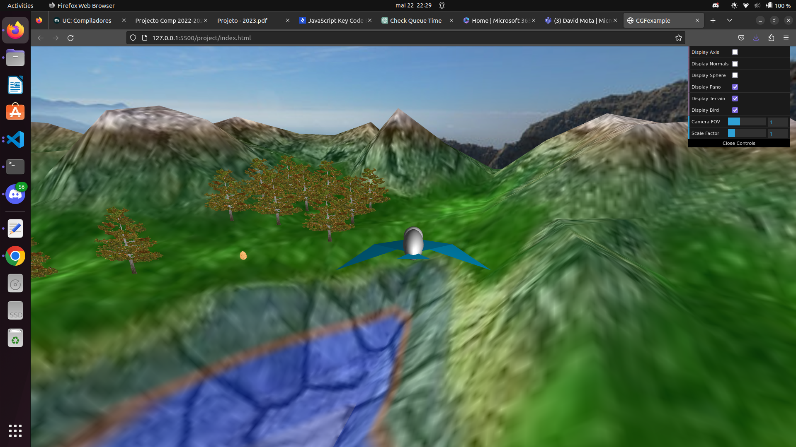

# CG 2022/2023

## Group T06G10

## Screenshots

- We also implemented an additional FOV slider.
- For Point 7, we chose to implement an height map for the trees in order to apply the terrain height automatically.

Panorama

Bird

Terrain

Bird flying and eggs

Trees

Trees on different heights
